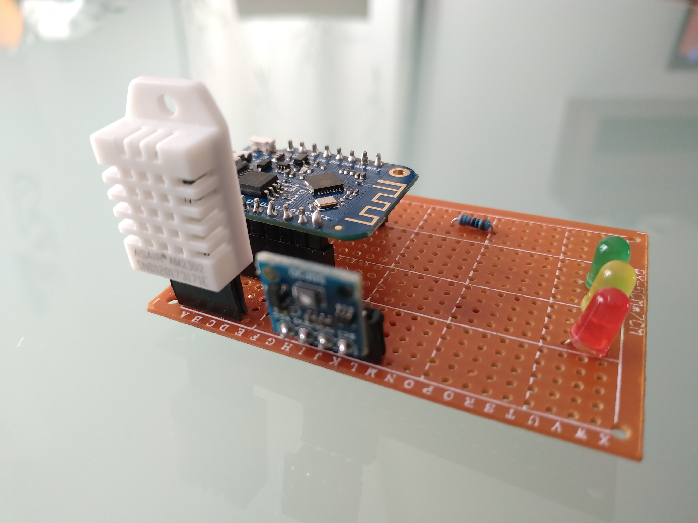
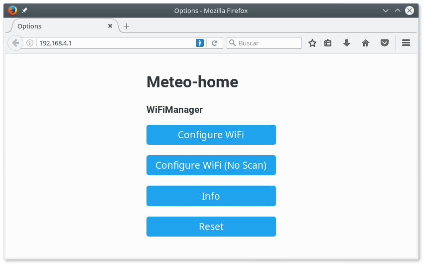
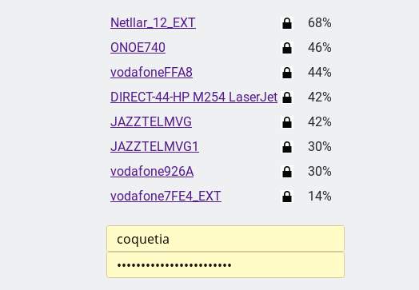
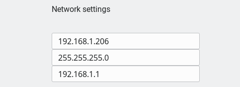
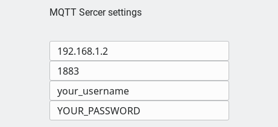
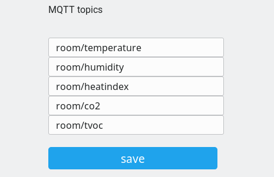
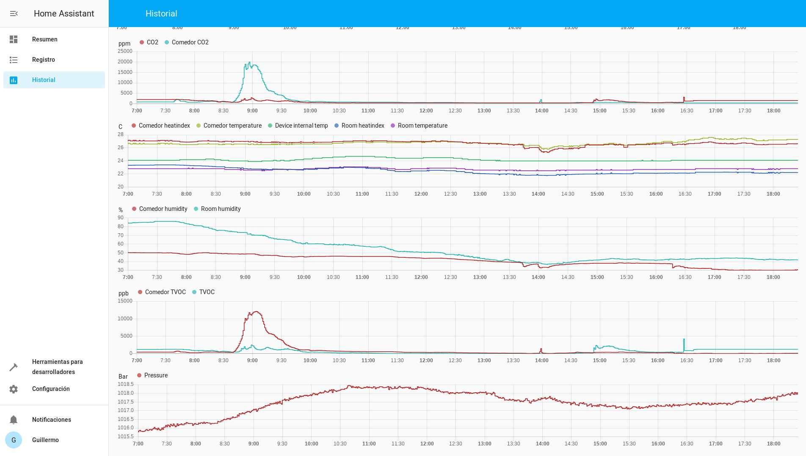

# CO2 detector

After reading [this article](https://theconversation.com/how-to-use-ventilation-and-air-filtration-to-prevent-the-spread-of-coronavirus-indoors-143732) ([ES](https://www.bbc.com/mundo/noticias-53754274)) I started to think about creating my own sensor board. I searched which sensor to use and the SGP30 seemed a good option to me. After a few tests, I modified the code of another project and then I built two prototypes which are currently working in my house. The device uses a mqtt queue to send data to an IoT gateway (a minipc running Home Assistant in my case). In addition to that, there are three LEDs to show what is the current state of the air based on CO2 PPMs:

- Green light is shown if there are less than 600 PPM of CO2.
- Yellow light if there are between 600 and 800 PPM.
- Red when the CO2 is greater than 800.

## Features
- Configuration of WiFi network and MQTT through a web portal.
- Temperature, humidity and air qualiity (CO2 and TVOC) sensors.
- Possibility of being used with Home Assistant or any software capable of reading a mqtt queue.

## Hardware

You will find the hardware shcemtaics and design files in the board dirctory. The hardware is distributed under the Cern Open Source Hardware License 1.2.

Note: currently I haven't tested the PCB design. I have ordered 5 boards to test the design but I can't guarantee that the PCB will work right now. My current prototypes are built using bread boards. You can use the schematic to build your own circuit as it show all the connections.

 

### Hardware components
- Wemos D1 mini
- DHT22 sensor
- SGP30 sensor
- Wires, tools...

## Software

The software is available unde Apache 2.0 license and can be found in the co2-detector directory.

### Requirements
- This source uses Arduino IDE and its standard libraries
- Additional libraries: WiFiManager, Arduino Json, PubSubClient, DHT and Adafruit SGP30
- A computer running MQTT
- [Optional] A computer running Home Assistant

## Configuration

During the first execution, the device will launch a WiFi access point. Using your PC or mobile device, check the available networks and connect to the network whose name starts with "CO2-detector". After that, point your browser to http://192.168.4.1 and the configuration page will be displayed. 

 

Choose the first option ("Configure WiFi") and select your WiFi network from the list of detected access points then, write your WiFi password.

 

Now configure you network settings.

 

The device will publish all sensor data through mqtt so, the information is sent to another machine such as a minipc used as an IoT gatway. To do that, you have to introduce the data of the mqtt server. 

 

Then, fill all the fields related to your MQTT topic names and save your configuration. If you have several devices in different places you can change the prefix (room1/Temperature, room2/Temperature and so on).

 

After saving the settings the device will be reset and then it will run in its normal mode, gathering data from all sensors.

## Home Assistant

I use Home Assistant to collect all the data and display the information. The software runs in a miniPC (a SolidRun CuBox-i) which is a small home IoT server and also has the Mosquitto mqtt broker. The device sends sensors data to the mqtt broker and Home Assistant reads it and stores everything in a data base. 
In addition to that Home Assistant has a frontend application that shows the current status of all your sensors and historical graphs of a selected day.
You can use any other similar software with the capability of subscribing to read from mqtt.

 
